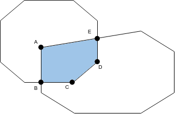

# Convex Hull Class

The goal of this project is to implement a Convex Hull Class without using 3rd party libraries (except for the Nlohman Json library).

This Git repository provides functionality for processing and manipulating Convex Hulls data in JSON format. The code can parse a JSON file containing Convex Hulls data and eliminate overlapping Convex Hulls based on a user-defined overlap threshold. The resulting Convex Hulls are then written to a new JSON file.

The main capabilities of the code include:

- Parsing a JSON file containing Convex Hulls data.
- Eliminating overlapping Convex Hulls based on a user-defined overlap threshold.
- Writing the resulting Convex Hulls to a new JSON file.

## How to Compile

### Requirements:

- CMake >= 3.14
- g++ >= 9.4.0

### Instructions:

1. Create a `build` directory: `mkdir build`
2. Navigate to the `build` directory: `cd build`
3. Configure the build: `cmake ../`
4. Build the project: `make`

To get the desired result (non overlapping convex hull JSON file):
5. Execute the app by running `./app "path/to/json/file"`. If you run the app by just typing `./app`, the program will search for a file called `convex_hulls.json` on a folder one level up the hierarchy of the executable, which is equivalent to running `./app ../convex_hulls.json`.
6. A file called `result_convex_hulls.json` will be created in the `build` folder with the remaining convex hulls as specified by `Directions.pdf`.

## Example

About convex polygon intersection:

The approach for computing the intersection between two convex polygons is similar to the one described in [AutowareAuto](https://autowarefoundation.gitlab.io/autoware.auto/AutowareAuto/convex-polygon-intersection-2d.html):

- Intersection of two convex polygons is a convex polygon.
- A vertex from a polygon that is contained in the other polygon is a vertex of the intersection shape (Vertices A, C, D in the shape above).
- An edge from a polygon that is contained in the other polygon is an edge in the intersection shape (edge C-D in the shape above).
- Edge intersections between two polygons are vertices in the intersection shape (Vertices B, E in the shape above).

## Inner-Workings / Algorithms:

With the observation mentioned above, the current algorithm operates in the following way:

1. Compute and find the vertices from each polygon that are contained in the other polygon (Vertices A, C, D on the attached image).
2. Compute and find the intersection points between each polygon (Vertices B, E on the attached image).
3. Compute the polygon shaped by these vertices by ordering them counterclockwise (CCW).
4. A polygon is tagged as "to be eliminated" if the resulting intersection polygon has an area that is greater than 50% of the polygon area.
